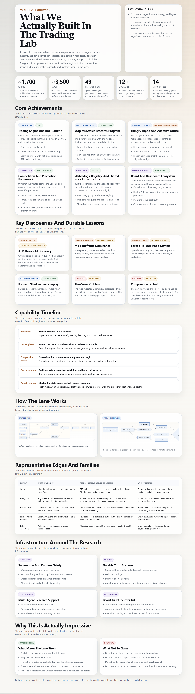
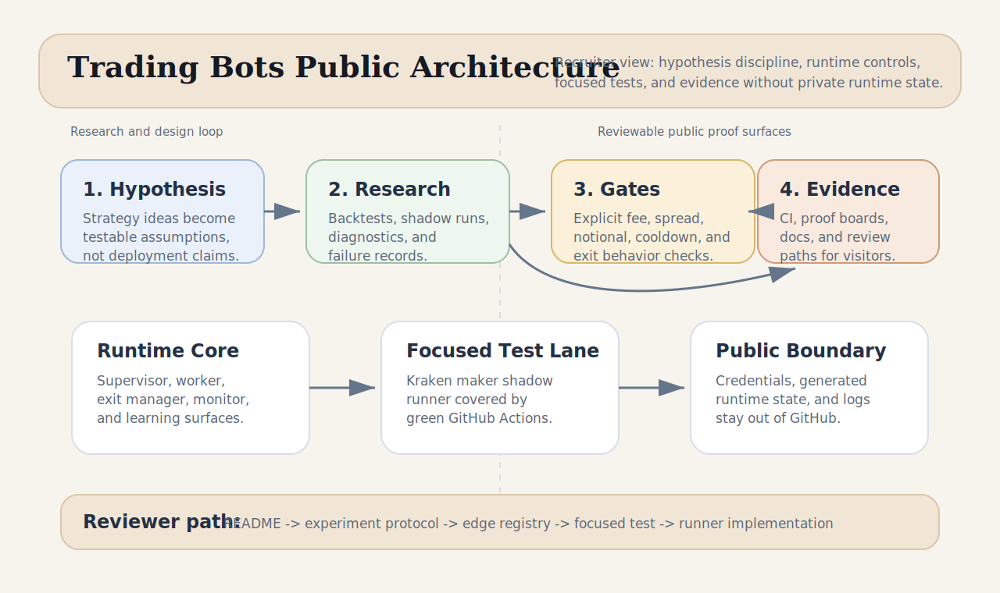

# Trading Bots Workspace - Quantitative Research & Execution Infrastructure

AI-assisted quantitative research system for testing trading ideas under explicit validation gates, runtime supervision, and evidence-preserving review.

This repository is best read as a **paper/experimental systems-research case study**, not as a profit claim. The engineering focus is hypothesis design, experiment control, telemetry, risk limits, watchdog supervision, and proof surfaces that keep both positive and negative evidence visible.

In this snapshot, "AI-assisted" means LLM-assisted system design, review, and iteration around rule-based/adaptive trading infrastructure. It does not claim a trained predictive model or autonomous black-box trading agent.

## Public Framing

For recruiter, client, or public review, this project should be evaluated as automation and research infrastructure:

- **Not live-performance marketing:** dollar figures in public evidence files are modeled, paper, shadow, or backtest accounting unless explicitly labeled otherwise.
- **Not financial advice:** nothing here recommends trading any instrument or deploying any strategy.
- **Not a black-box prediction claim:** the public signal is the system of tests, telemetry, guardrails, promotion gates, and falsification records.
- **Not a complete local runtime dump:** broker-connected state, credentials, private logs, generated payloads, and local runtime artifacts are intentionally excluded.

The hiring signal is the ability to build deterministic harnesses around noisy systems, preserve contrary evidence, and keep risk controls visible.

## How to Review This Repo

If you have **5 minutes**, check the CI badge, skim the system diagram, and read the Proof Snapshot. If you have **15 minutes**, read the experiment protocol and edge registry, then inspect the focused Kraken maker test. If you want the technical core, compare the focused test with the runner it covers.

## What This Demonstrates

- Building a multi-lane automation system with shared runtime controls and supervised execution paths.
- Turning messy strategy ideas into testable hypotheses with acceptance gates and failure records.
- Using AI-native workflows to design, operate, test, and revise a real local research system without hiding the audit trail.
- Separating public proof artifacts from local runtime state, credentials, broker-connected workflows, and generated logs.
- Maintaining a green, focused CI path for the highest-signal unit surface in the current public snapshot.

## Proof Snapshot

| Proof surface | What it shows |
| --- | --- |
| [Focused CI](https://github.com/GalToast/trading-bots/actions/workflows/focused-tests.yml) | GitHub Actions runs the Kraken maker shadow unit test suite. |
| [`scripts/test_live_kraken_spot_frontier_maker_machinegun_shadow.py`](./scripts/test_live_kraken_spot_frontier_maker_machinegun_shadow.py) | Focused tests for maker/taker accounting, spread gates, min-notional guards, reentry cooldowns, and exit behavior. |
| [`docs/evidence/edge_registry.md`](./docs/evidence/edge_registry.md) | Proof-board style registry of validated strategy families and backtest evidence. |
| [`docs/experiment-protocol.md`](./docs/experiment-protocol.md) | The graduation ladder for moving ideas from hypothesis to validated strategy. |
| [`docs/performance-review.md`](./docs/performance-review.md) | Performance review notes, including failure modes and limitations. |
| [`COMMAND_CENTER.md`](./COMMAND_CENTER.md) | Runtime posture, deployment gates, and decision status snapshot. |

## System Model

The project combines research scripts, strategy runners, runtime monitors, and documentation into a controlled experimentation loop:

1. Generate a strategy hypothesis.
2. Backtest or shadow-test it under explicit constraints.
3. Record proof, failure, and ambiguity instead of only preserving wins.
4. Promote only when the evidence meets the documented gate.
5. Keep runtime state and broker-connected details out of the public tree.

## Runtime Architecture

| Component | Role |
| --- | --- |
| `mt5_bot.py` | Canonical supervisor for monitored worker execution. |
| `mt5_bot_v10.py` | Canonical worker containing trading loop, entries, and exits. |
| `exit_manager.py` | Dynamic exit-policy companion. |
| `monitor.py` | Watchdog and health-check surface. |
| `brain.py` | Learning/adaptation logic; generated state is excluded from the public repo. |
| `bot/` | Policy subroutines for admission, competition lane priority, exits, posture, symbol risk, and price structure. |
| `scripts/live_kraken_spot_frontier_maker_machinegun_shadow.py` | Current focused Kraken maker shadow runner under unit coverage. |

## Repository Guide

| Path | Purpose |
| --- | --- |
| [`docs/QUICKSTART.md`](./docs/QUICKSTART.md) | Short orientation before touching broker-connected workflows. |
| [`docs/trading-lane-presentation.html`](./docs/trading-lane-presentation.html) | Browser-readable presentation surface for the system model. |
| [`docs/evidence/`](./docs/evidence/) | Public proof artifacts suitable for first-pass review. |
| [`docs/assets/system-architecture.svg`](./docs/assets/system-architecture.svg) | Architecture diagram for the public review path. |
| [`PUBLIC_REPO_BOUNDARIES.md`](./PUBLIC_REPO_BOUNDARIES.md) | What is public here, what stays private locally, and why. |
| [`scripts/README.md`](./scripts/README.md) | Curated guide to the large scripts directory. |
| [`scripts/`](./scripts/) | Research builders, runners, tests, and proof-board generators. |
| [`tests/`](./tests/) | Discoverable public smoke tests for core policy modules and CI stubs. |
| [`research/strategies/`](./research/strategies/) | Strategy prototypes and experiment families. |

## Recruiter Reading Path

Start with the CI badge, then read [`docs/experiment-protocol.md`](./docs/experiment-protocol.md) and [`docs/evidence/edge_registry.md`](./docs/evidence/edge_registry.md). After that, inspect the focused Kraken maker test and runner pair:

- [`scripts/test_live_kraken_spot_frontier_maker_machinegun_shadow.py`](./scripts/test_live_kraken_spot_frontier_maker_machinegun_shadow.py)
- [`scripts/live_kraken_spot_frontier_maker_machinegun_shadow.py`](./scripts/live_kraken_spot_frontier_maker_machinegun_shadow.py)

Those files show the most concrete engineering signal: strategy behavior is specified, tested, and constrained before being treated as deployable.

## Disclaimer

This is paper/experimental research infrastructure. It is not financial advice, not a guarantee of trading performance, not a live brokerage performance claim, and not a recommendation to trade any instrument.
